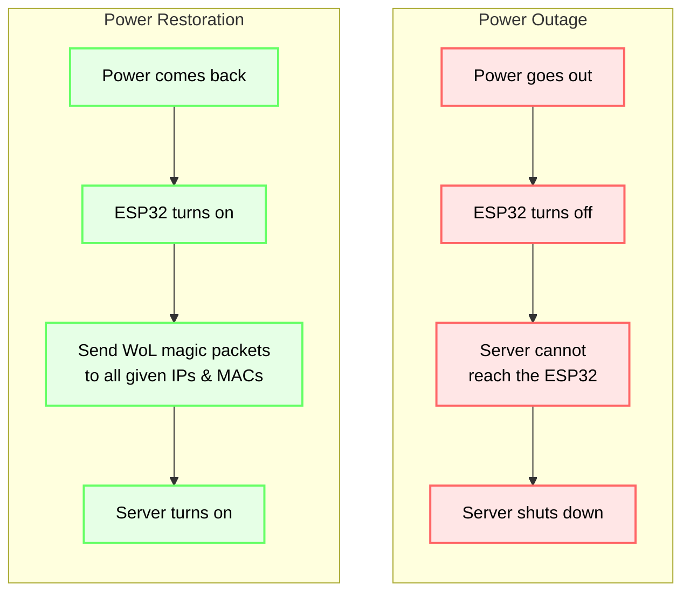

# WoL

```mermaid
graph TD
    subgraph Power_Outage [Power Outage]
        direction TD
        A[Power goes out] --> B[ESP32 turns off]
        B --> C[Server cannot<br>reach the ESP32]
        C --> D[Server shuts down]
    end

    subgraph Power_Restoration [Power Restoration]
        direction TD
        E[Power comes back] --> F[ESP32 turns on]
        F --> G[Send WoL magic packets<br>to all given IPs & MACs]
        G --> H[Server turns on]
    end
    
    classDef outage fill:#ffe6e6,stroke:#ff6666,stroke-width:2px,color:#000;
    classDef restore fill:#e6ffe6,stroke:#66ff66,stroke-width:2px,color:#000;
    
    class A,B,C,D outage;
    class E,F,G,H restore;
```
